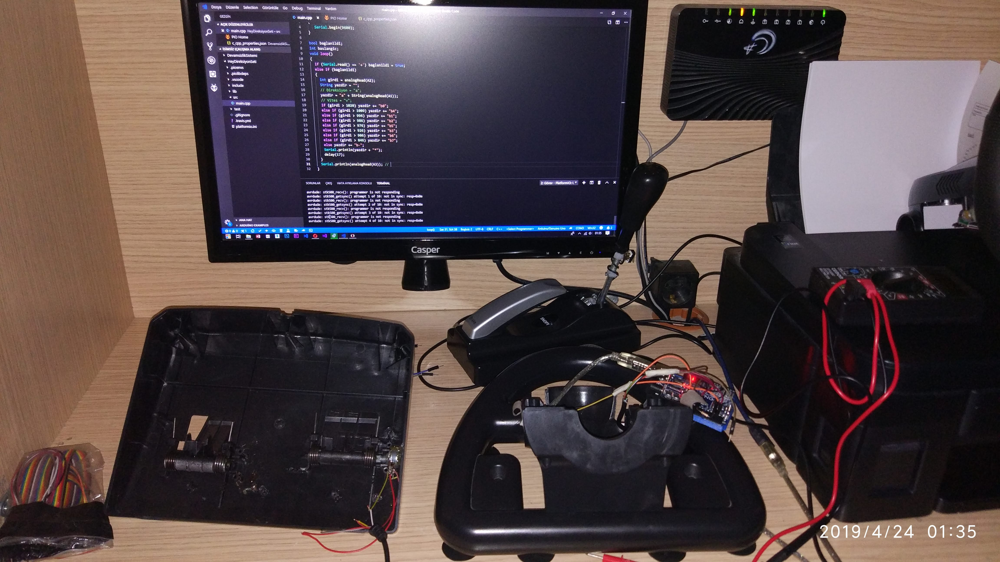
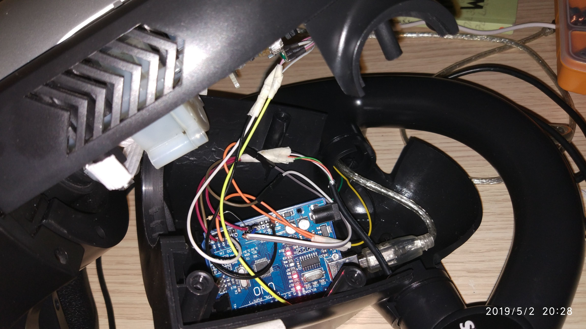
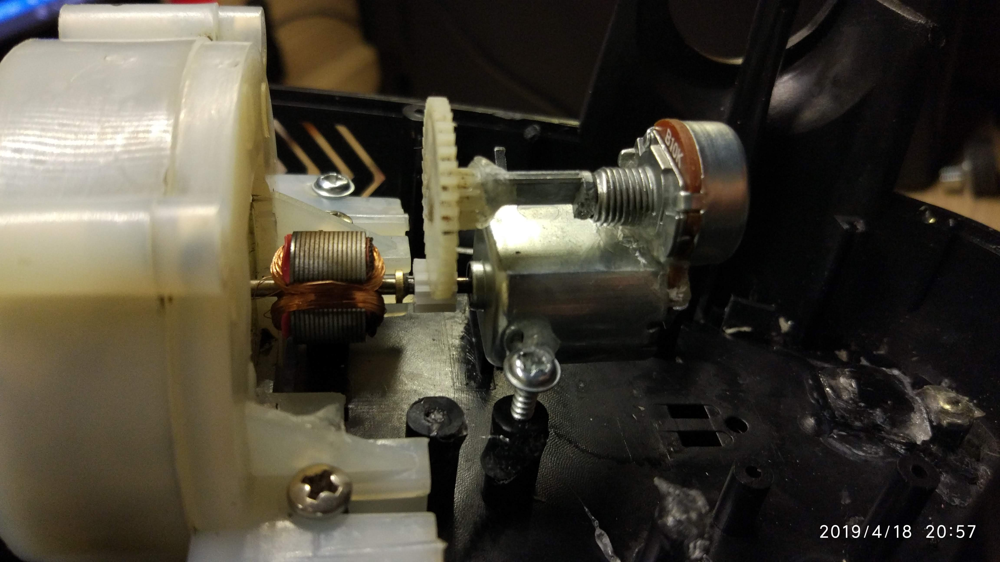

# HeyVJoyController - Arduino Gaming Wheel

A sophisticated Arduino-based (CH340) gaming controller system that transforms a basic 90-degree wheel into a professional 900-degree racing setup with clutch, brake, gas, and H-shifter functionality for Euro Truck Simulator 2 and other racing games.
Clone master branch only (without media): `git clone --single-branch --branch master https://github.com/JahnStar/Hey-vJoyController.git`

## Educational Note
This project was developed between 2019-2020 during high school through self-teaching and experimentation. Variable names and comments are in Turkish, reflecting the local development environment and learning process at the time. The project demonstrates hardware limitation problem-solving and innovative use of virtual device drivers.

## Project Gallery

<div align="center">
  
  
  
  
</div>

*Original hardware development from April-May 2019 - Arduino Uno CH340 with steering wheel, pedals, and H-shifter setup*

### Development Timeline Videos

**April 2019 - Initial Development**
- [Arduino Firmware Test](https://creative.jahnstar.com/?video_url=https://raw.githubusercontent.com/JahnStar/Hey-vJoyController/refs/heads/media/docs/VID_20190416_231621.mp4) - April 16, 2019
- [Hardware Setup Test](https://creative.jahnstar.com/?video_url=https://raw.githubusercontent.com/JahnStar/Hey-vJoyController/refs/heads/media/docs/VID_20190424_182519.mp4) - April 24, 2019

**May 2019 - System Integration & Game Compatibility Testing**  
- [Desktop Application Test](https://creative.jahnstar.com/?video_url=https://raw.githubusercontent.com/JahnStar/Hey-vJoyController/refs/heads/media/docs/VID_20190502_194803.mp4) - May 2, 2019
- [Dirt Rally Gameplay Test](https://creative.jahnstar.com/?video_url=https://raw.githubusercontent.com/JahnStar/Hey-vJoyController/refs/heads/media/docs/VID_20190502_184745(0).mp4) - May 2, 2019
- [ETS2 Gameplay Test](https://creative.jahnstar.com/?video_url=https://raw.githubusercontent.com/JahnStar/Hey-vJoyController/refs/heads/media/docs/VID_20190502_195722.mp4) - May 2, 2019
- [H-Shifter Functionality Test](https://creative.jahnstar.com/?video_url=https://raw.githubusercontent.com/JahnStar/Hey-vJoyController/refs/heads/media/docs/VID_33771122_132002_981.mp4) - May 20, 2019
- [NFS Payback Gameplay Test](https://creative.jahnstar.com/?video_url=https://raw.githubusercontent.com/JahnStar/Hey-vJoyController/refs/heads/media/docs/VID_20190706_034714.mp4) - July 6, 2019

**April 2020 - Final Software Version**
- [Advanced Software Features Test](https://creative.jahnstar.com/?video_url=https://raw.githubusercontent.com/JahnStar/Hey-vJoyController/refs/heads/media/docs/VID_20200421_003435(0).mp4) - April 21, 2020

### Technical Innovation

**Challenge**: Arduino Uno CH340 clones lack DFU (Device Firmware Upgrade) capabilities, making them unsuitable for direct HID device emulation.

**Solution**: Discovered and implemented vJoy SDK to create a virtual joystick interface, allowing budget hardware to function as a professional gaming controller.

### Key Innovations
1. **900° Steering System** - Mechanical gear system to convert standard 90° potentiometer to 900° rotation range
2. **Advanced Curve Editor** - Professional-grade response curve customization not available in commercial steering wheels
3. **Voltage-based Gear Detection** - Elegant H-shifter implementation using analog readings
4. **Custom Calibration System** - Min/max range adjustment with preset save/load functionality
5. **Low-latency Protocol** - Optimized serial communication for gaming performance
6. **Visual Real-time Feedback** - Interactive curve editor with mouse/wheel control

## Features

### Hardware Integration
- **Arduino Uno CH340** - Budget-friendly microcontroller solution
- **Potentiometer Reading** - Multi-axis analog input processing
- **H-Shifter System** - Voltage divider-based gear detection
- **Pedal Integration** - Separate brake, gas, and clutch inputs
- **Low-Latency Communication** - Optimized serial protocol for gaming

### Software Capabilities  
- **vJoy Integration** - Virtual joystick driver implementation
- **Professional Curve Editor** - Advanced response curve customization with visual feedback (feature not found in commercial wheels)
- **Interactive Calibration** - Click-and-drag curve points with real-time preview
- **Preset Management** - Save/load custom configurations for different games/preferences
- **Min/Max Range Control** - Precise dead zone and sensitivity adjustment
- **Button Remapping** - Flexible input-to-output button assignment
- **Multi-axis Support** - X, Y, Z, Rx, Ry, Rz, Slider, Dial axes

### Gaming Features
- **90° to 900° Conversion** - Mechanical gear system + software-based steering range expansion
- **Professional Response Curves** - Custom steering behavior adjustment (unavailable in commercial products)
- **Multi-turn Support** - Compatible with both standard and multi-turn potentiometers
- **Angle-specific Behavior** - Define exact steering response at any angle
- **Preset Profiles** - Save different configurations for various games
- **ETS2 Optimization** - Specifically tuned for Euro Truck Simulator 2
- **H-Pattern Shifter** - 7-speed + reverse gear detection
- **Pedal Calibration** - Individual axis tuning for realistic driving

## Hardware Setup

### Components Required
- Arduino Uno (CH340 or original)
- **Steering Wheel Options**:
  - Standard 10kΩ Potentiometer + Custom gear system for 900° rotation
  - OR 10kΩ Multi-turn Potentiometer (direct 900° support)
- 3x Potentiometers (10kΩ) - Brake, Gas, Clutch pedals
- Voltage divider circuit - H-shifter gear detection
- Resistor network for gear position mapping
- USB cable for Arduino connection
- Mechanical gear system (if using standard potentiometer)

### Arduino Connections
```
Analog Inputs:
A0 → Steering Wheel Potentiometer
A2 → H-Shifter Voltage Divider  
A3 → Brake Pedal Potentiometer
A5 → Gas Pedal Potentiometer

Digital Inputs:
Pin 3 → Clutch/Additional Button
Pin 4 → Secondary Button

Digital Outputs:
Pin 8 → Status LED / Motor Control
Pin 9 → Secondary Status LED
```

### H-Shifter Voltage Mapping
```cpp
// Voltage levels for gear detection
if (girdi > 1020) gear = 0;      // Neutral
else if (girdi > 1009) gear = 4; // 4th gear
else if (girdi > 996) gear = 1;  // 1st gear  
else if (girdi > 986) gear = 2;  // 2nd gear
else if (girdi > 976) gear = 5;  // 5th gear
else if (girdi > 926) gear = 3;  // 3rd gear
else if (girdi > 906) gear = 6;  // 6th gear
else if (girdi > 846) gear = 7;  // 7th gear / Reverse
```

## Software Requirements

### System Requirements
- Windows 7/10/11
- .NET Framework 4.0+
- **vJoy Driver** - Virtual joystick interface
- Available COM port for Arduino

### Dependencies
- vJoyInterface wrapper library
- Custom Hey.Math library for interpolation
- Serial communication libraries

## 🔧 Installation & Setup

### 1. vJoy Driver Installation
1. Download and install vJoy driver from official source
2. Configure virtual joystick device (ID 1-15)
3. Enable required axes (X, Y, Z, buttons)

### 2. Arduino Firmware
1. Upload the provided Arduino sketch
2. Connect hardware according to wiring diagram
3. Test serial communication at 9600 baud

### 3. Desktop Application
1. Run HeyVJoyController.exe
2. Select Arduino COM port
3. Connect to vJoy device (default ID: 1)
4. Calibrate axes and test functionality

## Usage Guide

### Initial Calibration
1. **Connect Hardware**: Ensure Arduino is connected and detected
2. **vJoy Setup**: Connect to virtual joystick device
3. **Axis Calibration**: Set min/max values for each axis
4. **Curve Tuning**: Use the visual curve editor for response customization
5. **Button Mapping**: Assign physical inputs to virtual buttons

### Curve Editor
- **Mouse Control**: Click and drag points to adjust response curve
- **Wheel Support**: Use mouse wheel for fine adjustments
- **Real-time Preview**: See changes instantly with visual feedback
- **Multiple Points**: Add/remove curve points for complex responses

### Gaming Integration
1. Launch game (Euro Truck Simulator 2, etc.)
2. Configure game to use vJoy device as controller
3. Map in-game controls to vJoy axes and buttons
4. Fine-tune settings using the curve editor

## System Architecture

```
┌─────────────────┐    Serial    ┌──────────────────┐    vJoy    ┌─────────────┐
│   Arduino       │ ◄──────────► │  Windows App     │ ◄────────► │    Game     │
│   - Wheel       │  (9600 baud) │  - Curve Editor  │  (Virtual) │   - ETS2    │
│   - Pedals      │              │  - Calibration   │  (Device)  │   - etc.    │
│   - H-Shifter   │              │  - vJoy Driver   │            │             │
└─────────────────┘              └──────────────────┘            └─────────────┘
```

## Code Architecture

### Arduino Firmware (Minimal Approach)
```cpp
// Optimized for minimal latency
String yazdir = "a" + String(analogRead(A0)); // Steering
// ... gear detection logic
yazdir += "c" + String(fren - 921) + "+" + String(gaz - 108);
Serial.println(yazdir + "*");
```

### C# Application (Processing Heavy)
```csharp
// Real-time data processing
float egriOran = Vektor.Vektor1_DogrusalInterpolasyon(noktaXNormali, nokta1, nokta2);
float yeniXeksen = egriOran * xEkseni;
joystick.SetAxis(value, kimlik, HID_USAGES.HID_USAGE_X);
```

## Performance Characteristics

- **Latency**: < 5ms end-to-end (Arduino → PC → vJoy → Game)
- **Resolution**: 10-bit ADC precision (1024 levels)
- **Update Rate**: Configurable (default: maximum possible)
- **Axes Supported**: 8 analog axes + 128 buttons
- **Curve Points**: Up to 37 customizable response points

## Gaming Applications

### Tested Games
- **Euro Truck Simulator 2** (Primary target)
- **Need for Speed Payback**
- **Dirt Rallyk**

## Troubleshooting

### Common Issues
- **vJoy not detected**: Install/reinstall vJoy driver
- **Arduino connection**: Check COM port and baud rate
- **Calibration problems**: Reset axis ranges and recalibrate
- **Game compatibility**: Ensure game supports DirectInput

### Debug Features
- Real-time axis value display
- Connection status indicators
- Serial communication monitoring
- Visual curve verification

## License
MIT License

Developed by Halil Emre Yildiz (c) Copyright 2019-2020
